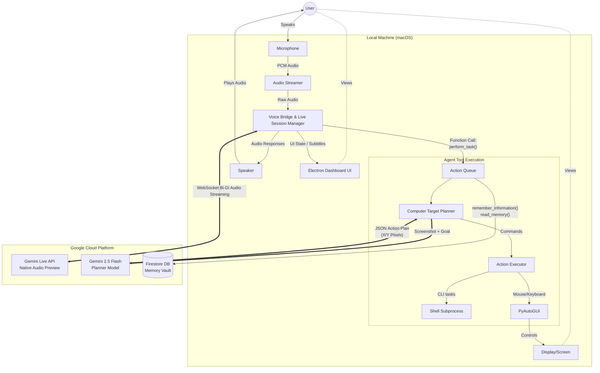

# OmniCompanion Architecture

```mermaid
graph TD
    %% Main Users & Interfaces
    User((User))
    Mic[Microphone]
    Speaker[Speaker]
    Screen[Display/Screen]
    ElectronUI[Electron Dashboard UI]

    %% Interactions
    User -- Speaks --> Mic
    User -. Views .- ElectronUI
    User -. Views .- Screen
    Speaker -- Plays Audio --> User

    %% Local System Core
    subgraph "Local Machine (macOS)"
        Mic -- PCM Audio --> AudioStream[Audio Streamer]
        AudioStream -- Raw Audio --> LiveAgent
        
        LiveAgent[Voice Bridge & Live Session Manager]
        LiveAgent -- Audio Responses --> Speaker
        LiveAgent -- UI State / Subtitles --> ElectronUI
        
        subgraph "Agent Tool Execution"
            ToolQueue[Action Queue]
            Planner[Computer Target Planner]
            Executor[Action Executor]
            Terminal[Shell Subprocess]
            GUI[PyAutoGUI]
        end
        
        LiveAgent -- "Function Call:\nperform_task()" --> ToolQueue
        ToolQueue --> Planner
        Planner -- "Commands" --> Executor
        Executor -- "CLI tasks" --> Terminal
        Executor -- "Mouse/Keyboard" --> GUI
        GUI -- Controls --> Screen
    end

    %% Google Cloud Integration
    subgraph "Google Cloud Platform"
        GeminiLive[Gemini Live API\nNative Audio Preview]
        GeminiFlash[Gemini 2.5 Flash\nPlanner Model]
        Firestore[(Firestore DB\nMemory Vault)]
    end

    %% Cloud Links
    LiveAgent <==> |"WebSocket Bi-Di Audio Streaming"| GeminiLive
    Planner == "Screenshot + Goal" ==> GeminiFlash
    GeminiFlash == "JSON Action Plan\n(X/Y Pixels)" ==> Planner
    
    ToolQueue -- "remember_information()\nread_memory()" --> Firestore
```
